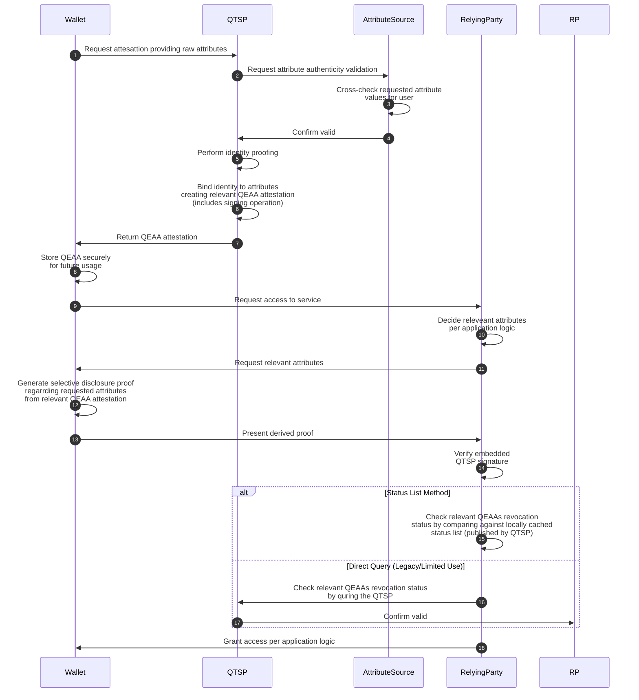

# Πιστοποιημένη Ηλεκτρονική Διαπίστευση Ιδιοτήτων (QTSP/QEAA)

QEAA (Qualified Electronic Attestation of Attributes) σημαίνει
ψηφιακά υπογεγραμμένο έγγραφο που εκδίδεται από πιστοποιημένο πάροχο (QTSP)
και βεβαιώνει περί φερόμενων ιδιοτήτων φυσικού ή νομικού προσώπου
(π.χ., ότι κάποιος είναι άνω των 18 και κατέχει συγκεκριμένο πανεπιστημιακό
τίτλο ή ότι μια εταιρία είναι εγεγραμμένη σε συγκεκριμένο μητρώο και κατέχει
κάποια σχετική άδεια). Επιτρέπει στον κάτοχό του να επιδεικνύει
επιλεγμένα στοιχεία χωρίς να αποκαλύπτει περιττές πρσωπικές
ή άλλου ιδιωτικού τύπου πληροφορίες.

## Συμβαλλόμενα μέρη

### Χρήστης με wallet

Το υποκείμενο της QEAA, δηλαδή
ο φυσικός ή νομικός φορέας των διαπιστευόμενων ιδιοτήτων.
Η εφαρμογή wallet είναι ο αναγνωρισμένος agent
(π.χ. EUDIW) μέσω του οποίου ο χρήστης αλληλεπιδρά με τα υπόλοιπα μέρη.
Ο χρήστης απευθύνεται ανά πάσα στιγμή σε QTSP προκειμένου να αιτηθεί
ψηφιακή απόδειξη για κάτι σχετικό με τον εαυτό του,
την οποία αποθηκεύει στο wallet.
Όποτε χρειαστεί να επιδείξει αυτήν την αντίστοιχη ιδιότητα σε κάποια υπηρεσία,
δίνει εντολή στο wallet του να παρουσιάσει την QEAA ελέγοντας ακριβώς
το μέρος των πληροφοριών που αποκαλύπτονται
(π.χ., μια υπηρεσία δε χρειάζεται να γνωρίζει την ακριβή ημερομηνία
γέννησης του χρήστη, παρά μόνον ότι είναι άνω των 18).

### Πιστοποιημένος πάροχος (QTSP)

Ισχυρά πιστποιημένη υπηρεσία με αναγνωρισμένο δικαίωμα έκδoσης QEAA.
Λαμβάνει σχετικό αίτημα από χρήστη με wallet, το οποίο επαληθεύει διεξοδικά
αλληεπιδρώντας με κυβερνητικές ή άλλες δημόσιες βάσεις δεδομένων
(π.χ., ότι ο χρήστης κατέχει συγκεκριμένο πανεπιστημιακό τίτλο).
Κατόπιν επιβεβαίωσης, ο πάροχος επαληθεύει επίσης ότι ο κάτοχος του wallet
είναι πράγματι το υποκείμενο της ζητούμενης QEAA.
Σε περίπτωση επιτυχίας, εκδίδει την QEAA υπογράφοντάς την
με την επίσημη ψηφιακή του σφραγίδα.
Ο QTSP διατηρεί επίσης λίστα με ανακλημένες QEAA,
την οποία μπορούν να συμβουλεύονται ανά πάσα στιγμή τα εξαρτώμενα μέρη.

### Attribute source

Αναγνωρισμένος φορέας που διατηρεί και παρέχει αξιόπιστη πληροφορία
σχετικά με χρήστες
(κυβερνητικό μητρώο, ακαδημαϊκό ίδρυμα κτλ).
Αλληλεπιδρά μόνο με τον QTSP, όταν αυτός επικοινωνεί
προκειμένου να επιβεβαιώσει ότι οι φερόμενες ιδιότητες ενός χρήστη ταιριάζουν
με τα επίσημα αρχεία. Πηγή της πρωταρχικής αλήθειας στην οποία βασίζεται
η εμπιστευσιμότητα του συστήματος.

### Εξαρτώμενο μέρος (RP)

Πάροχος υπηρεσιών που χρειάζεται να επαληθεύσει συγκεριμένες ιδιότητες
για κάποιον αυτοπαρουσιαζόμενο χρήστη προτού δώσει πρόσβαση.
Όταν ο χρήστης αιτείται πρόσβαση σε υπηρεσία μέσω του wallet του,
ο RP ζητά απόδειξη περί συγκεκριμένων ιδιοτήτων
και λαμβάνει κρυπτογραφική απόδειξη βασισμένη στα σχετικά QEAAs
που ο χρήστης διατηρεί στο wallet του.
Κατόπιν, ο RP επαληθεύει την απόδειξη
έναντι του δημοσίου κλειδιού του QTSP που εξέδωσε τις σχετικές QEAAs,
ελέγχοντας συγχρόνως ότι αυτές δεν έχουν ανακληθεί.

## Παραδοχές εμπιστευσιμότητας

Το πρωταρχικό πρόβλημα είναι ότι δεν υπάρχει εμπιστοσύνη μεταξύ χρήστη και RP.
Το σύστημα την υποκαθιστά με διαδικασίες κρυπτογραφικής επαλήθευσης
που βασίζεται σε εμπιστεύσιμα δημόσια μητρώα.
Συγκεκριμένα, wallet και RP εμπιστεύονται κατά τη διάρκεια της διαδικασίας
τον QTSP επειδή οι QEAA τις οποίες εξέδωσε (ή οι παράγωγες αποδείξεις)
είναι επαληθεύσιμες έναντι του δημοσίου κλειδιού του.

Αυτό σημαίνει ότι η εμπιστευσιμότητα του QTSP ανάγεται στην εμπιστευσιμότητα
της εξωτερικής αρχής που πιστοποιεί ως authority
την εκ μέρους του κατοχή του δημοσίου κλειδιού του, δηλαδή στην EU Trusted List.
O RP  (και ενδεχομένως το wallet) οφείλει να κατεβάσει αυτή τη λίστα
μέσω ασφαλούς καναλιού επικοκνωνίας
και να παρακολουθεί τακτικά την επικαιροποίησή της.

Τέλος, η λειτουργική ορθότητα του συστήματος βασίζεται
προφανώς στην εμπιστευσιμότητα του attribute source ως παρόχου πληροφοριών
για τους χρήστες, Ακόμα κι αν ένας QTSP
έχει εσωτερικούς μηανισμούς πιστοποίηση φερόμενων ιδιοτήτων,
η υποκείμενη παραδοχή είναι ότι ένα attribute source λέει πάντοτε
την αλήθεια.

## Ροή QEAA

### Έκδοση (Issuance)

1. To wallet αιτείται QEAA για φερόμενες ιδιότητες του χρήστη
  υποβάλλοντας τα σχετικά έγγραφα στον QTSP.
2. O QTSP έρχεται σε απαφή με το attribute source προκειμένου να επαληθεύσει
  τις φερόμενες ιδιότητες.
3. Το attribute source διασταυρώνει τις φερόμενες ιδιότητες.
4. Το attribute source απαντά στον QTSP επιβεβαιώνοντας.
5. Ο QTSP διενεργεί ισχυρή ταυτοποίηση του χρήστη σε πραγματικό χρόνο
  (π.χ., μέσω βιντεοκλήσης ή σύγκρισης βιομετρικών δεδομένων).
6. Ο QTSP προσδένει κρυπτογραφικά την ταυτότητα του χρήστη
  στις επαληθευμένες ιδιότητες, υπογράφοντάς
  με το ιδιωτικό κλειδί που αντιστοιχεί στην αναγνωρισμένη ψηφιακή του σφραγίδα.
  To διαπιστευτήριο αυτό αποτελεί την QEAA της συγκεκριμένης ροής.
7. O QTSP "εκδίδει" την QEAA για λογαριασμό του χρήστη στέλνοντάς τη στο wallet του.
8. Το wallet αποθηκεύει την QEAA ως φορητό διαπιστευτήριο
  σε κάποιο προστατευμένο τοπικό περιβάλλον (συνήθως hardware-backed storage).

### Παρουσίαση (Presentation)

9. Ο χρήστης αιτείται μέσω του wallet του πρόσβαση σε υπηρεσία παρεχόμενη
  από τον RP.
10. O RP αποφασίζει ποιες ιδιότητες του αυτοπαρουσιαζόμενου χρήστη χρειάζεται
  να επικυρώσει προτού του παρέχει πρόσβαση.
11. Ο RP απάντα στο wallet ζητώντας διαπίστευση των σχετικών ιδιοτήτων.
12. Το wallet παράγει selective disclosure proof (SDP)
  για τις ζητηθείσες ιδιότητες βάσει των σχετικών QEAA διαπιστευτηρίων
  που έχει τοπικά αποθηκευμένα.
13. Το wallet στέλνει την SDP στον RP.
14. O RP επικυρώνει τις εμφωλευμένες κρυπτογραφικές αποδείξεις έναντι
  της ψηφιακής σφραγίδας (δηλ. του δημοσίου κλειδιού) του QTSP.
15. Ο RP ελέγχει το revocation status των σχετικών QEAAs βάσει
  της συμφωνημένης πολιτικής (τοπική αντιπαραβολή με την τοπικά σωζμένη
  status list ή live αλληλεπίδραση με τον σχετικό QTSP).
