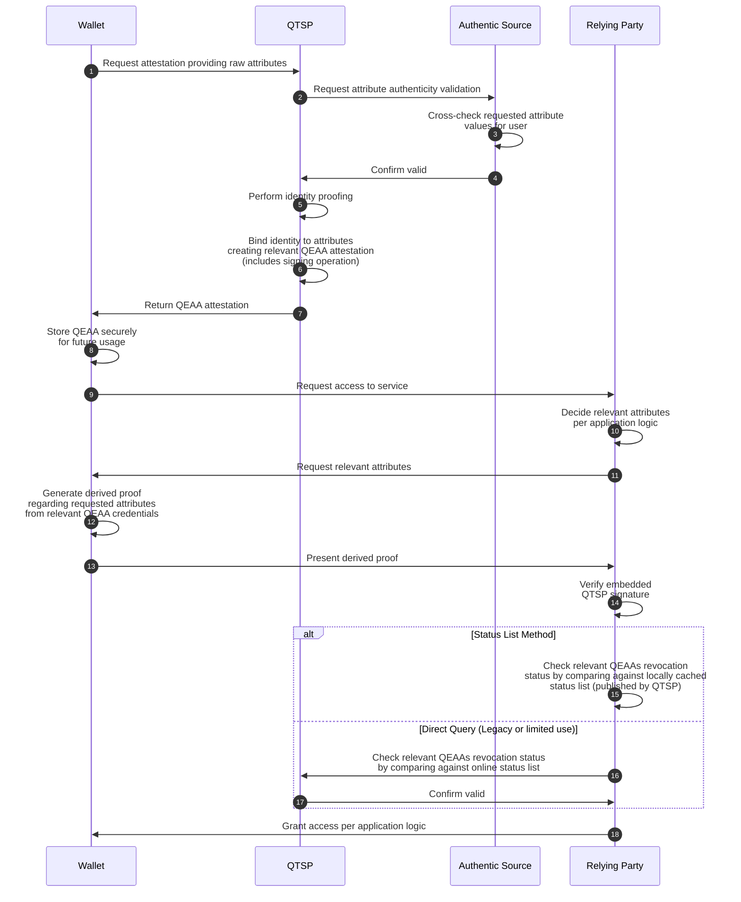

# Πιστοποιημένη Ηλεκτρονική Διαπίστευση Ιδιοτήτων (QEAA)

QEAA (Qualified Electronic Attestation of Attributes) σημαίνει
ένα δομημένο διαπιστευτήριο σφραγισμένο
(δηλ. υπογεγραμμένο) από πιστοποιημένο πάροχο (QTSP),
ο οποίος βεβαιώνει περί φερόμενων ιδιοτήτων φυσικού ή νομικού προσώπου
(π.χ., ότι κάποιος είναι άνω των 18 και κατέχει συγκεκριμένο πανεπιστημιακό
τίτλο ή ότι μια εταιρία είναι εγγεγραμμένη σε συγκεκριμένο μητρώο και κατέχει
κάποια σχετική άδεια). Υπό συνθήκες, επιτρέπει στον κάτοχό του να επιδεικνύει
επιλεγμένα στοιχεία χωρίς να αποκαλύπτει περιττές προσωπικές
ή άλλου ιδιωτικού τύπου πληροφορίες.

## Συμβαλλόμενα μέρη

### Χρήστης με wallet

Το υποκείμενο ενός QEAA, δηλαδή
ο φυσικός ή νομικός φορέας των διαπιστευόμενων ιδιοτήτων.
Η εφαρμογή wallet είναι ο αναγνωρισμένος agent
(π.χ. EUDIW) μέσω του οποίου ο χρήστης αλληλεπιδρά με τα υπόλοιπα μέρη.
Ο χρήστης απευθύνεται ανά πάσα στιγμή σε QTSP προκειμένου να αιτηθεί
ψηφιακό διαπιστευτήριο QEAA,
το οποία αποθηκεύει στο wallet.
Όποτε χρειαστεί να επιδείξει αυτήν την ιδιότητα σε κάποια υπηρεσία,
δίνει εντολή στο wallet να παρουσιάσει το αντίστοιχο QEAA ελέγχοντας
ποιες ακριβώς πληροφορίες θα αποκαλυφθούν
(π.χ., μια υπηρεσία δε χρειάζεται να γνωρίζει την ακριβή ημερομηνία
γέννησης του χρήστη, παρά μόνον ότι είναι άνω των 18).

### Πιστοποιημένος πάροχος (QTSP)

Ισχυρά πιστοποιημένη υπηρεσία με αναγνωρισμένο δικαίωμα έκδoσης QEAA.
Λαμβάνει σχετικό αίτημα από χρήστη, το οποίο επαληθεύει διεξοδικά
αλληλεπιδρώντας με κυβερνητικές ή άλλες δημόσιες βάσεις δεδομένων
(π.χ., ότι ο χρήστης κατέχει συγκεκριμένο πανεπιστημιακό τίτλο).
Κατόπιν επιβεβαίωσης, ο πάροχος επαληθεύει επίσης ότι ο κάτοχος του wallet
είναι πράγματι το υποκείμενο του ζητούμενου διαπιστευτηρίου.
Σε περίπτωση επιτυχίας, εκδίδει QEAA υπογράφοντάς το
με την επίσημη ψηφιακή του σφραγίδα.
Ο QTSP διατηρεί επίσης λίστα με ανακλημένα διαπιστευτήρια,
την οποία μπορούν να συμβουλεύονται ανά πάσα στιγμή τα εξαρτώμενα μέρη.

### Authentic source

Αναγνωρισμένος φορέας που διατηρεί και παρέχει αξιόπιστη πληροφορία
σχετικά με χρήστες (κυβερνητικό μητρώο, ακαδημαϊκό ίδρυμα κτλ).
Αλληλεπιδρά μόνο με τον QTSP, όποτε αυτός ζητά επιβεβαίωση ότι οι φερόμενες
ιδιότητες κάποιου χρήστη ταιριάζουν με τα επίσημα αρχεία.
Πηγή της πρωταρχικής αλήθειας στην οποία βασίζεται
η λειτουργική ορθότητα του συστήματος.

### Εξαρτώμενο μέρος (RP)

Πάροχος υπηρεσιών που πρέπει να επαληθεύσει συγκεκριμένες ιδιότητες
προτού δώσει πρόσβαση σε κάποιον αυτοπαρουσιαζόμενο χρήστη.
Όταν ο χρήστης αιτείται πρόσβαση μέσω του wallet του,
ο RP ζητά απόδειξη περί συγκεκριμένων ιδιοτήτων,
η οποία παράγεται από το wallet βάσει των σχετικών QEAAs
που διατηρούνται τοπικά αποθηκευμένα.
Ο RP επαληθεύει την απόδειξη
έναντι του δημοσίου κλειδιού του αντίστοιχου QTSP,
ελέγχοντας συγχρόνως ότι αυτές δεν έχουν ανακληθεί.

## Παραδοχές εμπιστευσιμότητας

Το πρωταρχικό πρόβλημα είναι ότι δεν υπάρχει εμπιστοσύνη μεταξύ χρήστη και RP.
Το σύστημα την υποκαθιστά με διαδικασίες κρυπτογραφικής επαλήθευσης
βασισμένης σε δημόσια μητρώα.
Συγκεκριμένα, wallet και RP εμπιστεύονται κατά τη διάρκεια της διαδικασίας
τον QTSP επειδή τα διαπιστευτήρια που εκδίδει (ή οι παράγωγες αποδείξεις)
είναι επαληθεύσιμες έναντι του δημοσίου κλειδιού του.

Αυτό σημαίνει ότι η εμπιστευσιμότητα του QTSP ανάγεται στην
εξωτερική αρχή που πιστοποιεί ως authority το δημόσιο κλειδί του,
δηλαδή την EU Trusted List.
O RP (και ενδεχομένως το wallet) οφείλει να κατεβάσει αυτή τη λίστα
μέσω ασφαλούς καναλιού επικοινωνίας
και να παρακολουθεί τακτικά την επικαιροποίησή της.

Τέλος, η λειτουργική ορθότητα του συστήματος βασίζεται
 στην εμπιστευσιμότητα του authentic source ως παρόχου πληροφοριών
για τους χρήστες. Ακόμα κι αν ένας QTSP
έχει εσωτερικούς μηxανισμούς πιστοποίησης φερόμενων ιδιοτήτων,
η υποκείμενη παραδοχή παραμένει ότι ένα authentic source λέει πάντοτε
την αλήθεια.

## Ροή QEAA

### Έκδοση (Issuance)

1. To wallet αιτείται QEAA για φερόμενες ιδιότητες του χρήστη
  υποβάλλοντας τα σχετικά έγγραφα στον QTSP.
2. O QTSP έρχεται σε επαφή με το authentic source προκειμένου προς επαλήθευση
  των φερόμενων ιδιοτήτων.
3. Το authentic source διασταυρώνει τις φερόμενες ιδιότητες με τα αρχεία του.
4. Το authentic source απαντά στον QTSP επιβεβαιώνοντας.
5. Ο QTSP διενεργεί ισχυρή ταυτοποίηση του χρήστη σε πραγματικό χρόνο
  (π.χ., μέσω βιντεοκλήσης ή σύγκρισης βιομετρικών δεδομένων).
6. Ο QTSP προσδένει κρυπτογραφικά την ταυτότητα του χρήστη
  στις επαληθευμένες ιδιότητες, υπογράφοντάς
  με το ιδιωτικό κλειδί που αντιστοιχεί στην αναγνωρισμένη ψηφιακή του σφραγίδα.
  Αυτό είναι το QEAA διαπιστευτήριο που παράγεται
  κατά την τρέχουσα διαδικασία διαπίστευσης.
7. O QTSP "εκδίδει" το QEAA διαπιστευτήριο για λογαριασμό του χρήστη
  στέλνοντάς το στο wallet του.
8. Το wallet αποθηκεύει το φορητό QEAA διαπιστευτήριο
  σε κάποιο προστατευμένο τοπικό περιβάλλον (συνήθως hardware-backed storage)
  προς μελλοντική χρήση.

### Παρουσίαση (Presentation)

9. Το wallet αιτείται πρόσβαση σε υπηρεσία παρεχόμενη από τον RP.
10. O RP αποφασίζει ποιες ιδιότητες του αυτοπαρουσιαζόμενου χρήστη χρειάζεται
  να επικυρώσει.
11. Ο RP απάντα στο wallet ζητώντας διαπίστευση των σχετικών ιδιοτήτων.
12. Το wallet παράγει επαληθεύσιμη κρυπτογραφική απόδειξη (π.χ., SD-JWT)
  των εν λόγω ιδιοτήτων βάσει των σχετικών QEAA διαπιστευτηρίων
  που έχει τοπικά αποθηκευμένα.
13. Το wallet στέλνει την SDP στον RP.
14. O RP ελέγχει το διαπιστευτήριο, επικυρώνοντας μεταξύ άλλως τις εμφωλευμένες
  υπογραφές έναντι της ψηφιακής σφραγίδας (δηλ. του δημοσίου κλειδιού) του QTSP.
15. Ο RP ελέγχει το revocation status των σχετικών QEAAs βάσει
  της αποφασισμένης μεθόδου (τοπική αντιπαραβολή έναντι cached
  λίστας ή live αλληλεπίδραση με τον αντίστοιχο QTSP).
